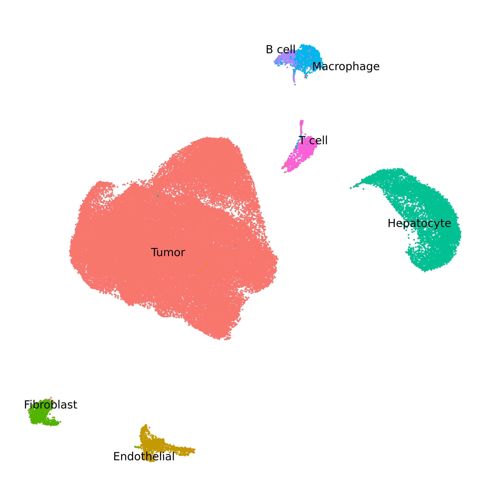
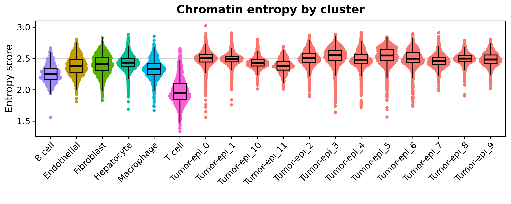
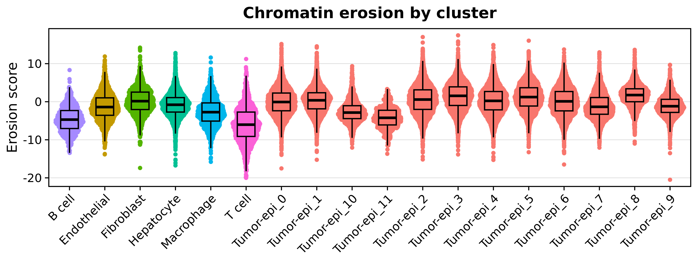
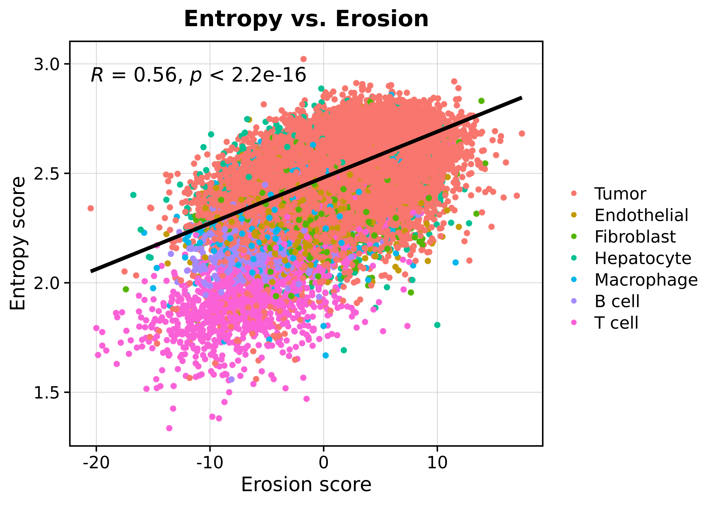
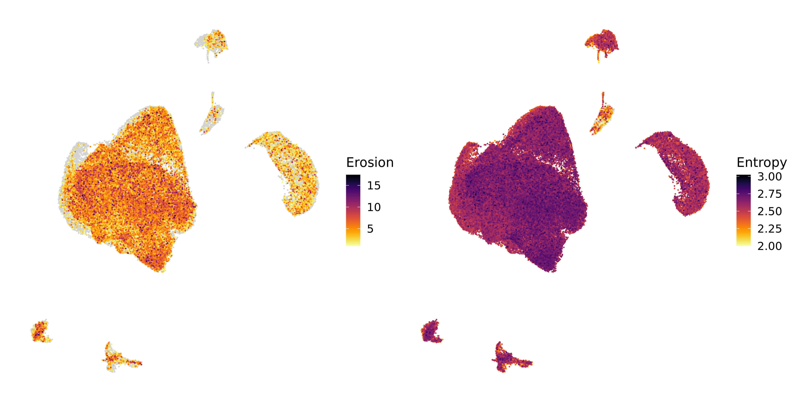

Compiled: 27-09-2025

Source: `vignettes/scATAC.Rmd`

# Introduction

This tutorial demonstrates the key functionality of `chromatic` to calculate cell-level *chromatin entropy* and *chromatin erosion* scores in a scATAC-seq dataset. For this tutorial, we demonstrate the package on a dataset of colorectal cancer tumors profiled with 10X Genomics Multiome (ATAC + RNA), although only the ATAC assay is needed for the analysis. At this time the dataset is not currently available to the public, but in the future we will update this tutorial to use a publicly available dataset. To follow along with this tutorial, please use your own dataset. First let's define these scores.

* **Entropy score**: Measures the diversity of chromatin states within a cell, with higher values indicating greater epigenomic heterogeneity or plasticity.

* **Erosion score**: Quantifies the degree to which a cell’s chromatin state profile shifts toward repressive versus active states, based on signed and normalized chromatin state abundances. Positive scores indicate an enrichment of repressive states while negative values indicate enrichment of active states.

---

## Load the dataset and required libraries

First we load the processed dataset and the required R libraries for this tutorial.

```{r eval=FALSE}
# single-cell analysis packages
library(Seurat)
library(Signac)

# data / plotting packages
library(tidyverse)
library(cowplot)
library(patchwork)
theme_set(theme_cowplot())

# additional Genomics packages
library(EnsDb.Hsapiens.v86)
library(BSgenome.Hsapiens.UCSC.hg38)
library(GenomicRanges)
library(rtracklayer) 

# load the processed Seurat object
seurat_obj <- readRDS("CRC_Tumor_multiome.rds")

```

To get acquainted with this dataset, let's check the UMAP colored by clusters. 



<details> <summary> See code </summary>

```{r eval=FALSE}
p <- DimPlot(
  seurat_obj,
  group.by = 'anno',
  reduction = 'umap',
  label = TRUE,
  repel = TRUE,
  raster=FALSE
) + theme_void() + ggtitle("") + NoLegend() + theme(
    panel.border = element_rect(fill=NA, color='black', linewidth=0.25)
)
```

</details>

---

# Run chromatic 

## Set up chromatin states 

In order to run `chromatic`, we require a [`GenomicRanges`](https://bioconductor.org/packages/devel/bioc/vignettes/GenomicRanges/inst/doc/GenomicRangesIntroduction.html) object containing information about which genomic regions correspond to which chromatin state. We recommend using chromatin states generated via [`ChromHMM`](https://compbio.mit.edu/ChromHMM/). 

Importantly, chromatin states exhibit considerable biological variation across cell lineages, tissues, and species. Therefore it is important to choose an appropriate reference for our dataset. In this tutorial, we are using a colorectal cancer dataset, so we require a chromatin state reference for the colon. 

The [ROADMAP epigenomics project](https://egg2.wustl.edu/roadmap/web_portal/index.html) hosts chromatin states that have been computed in many different human tissues, including the colon. We use the function `FetchChromatinStates` to download the relevant ChromHMM chromatin states, and load it into R as a `GenomicRanges` object.

```{r eval=FALSE}
chromHMM_states <- FetchChromatinStates(
  tissue = "Colon", # input the tissue ID, mnemonic, or name
  model = 15, # select the 15 state, 18 state, or 25 state model
  genome = 'hg38' # select hg19 or hg38
)
```

<details> <summary> Additional information </summary>

When we run this function, first we see the following message:

```
Multiple tissues matched your input:
   EID      Mnemonic                Name
1 E076 GI.CLN.SM.MUS Colon Smooth Muscle
2 E106    GI.CLN.SIG       Sigmoid Colon
3 E075    GI.CLN.MUC      Colonic Mucosa
Enter the row number of the tissue you want: 2

Downloading ChromHMM segmentation from: https://egg2.wustl.edu/roadmap/data/byFileType/chromhmmSegmentations/ChmmModels/coreMarks/jointModel/final/E106_15_coreMarks_hg38lift_mnemonics.bed.gz
trying URL 'https://egg2.wustl.edu/roadmap/data/byFileType/chromhmmSegmentations/ChmmModels/coreMarks/jointModel/final/E106_15_coreMarks_hg38lift_mnemonics.bed.gz'
Content type 'application/x-gzip' length 2302510 bytes (2.2 MB)
==================================================
downloaded 2.2 MB

Loaded 393420 regions for E106 (GI.CLN.SIG, Sigmoid Colon) — 15-state model, genome hg38
```

The function tries to match the `tissue` argument to the list of tissues profiled in the ROADMAP project. The table containing this information is included in `chromatic` in an object called `tissue_map`.

```{r eval=FALSE}
head(tissue_map)
```

```
head(tissue_map)
   EID GROUP   Mnemonic                                   Name
1 E017 IMR90  LNG.IMR90 IMR90 fetal lung fibroblasts Cell Line
2 E002   ESC    ESC.WA7                           ES-WA7 Cells
3 E008   ESC     ESC.H9                               H9 Cells
4 E001   ESC     ESC.I3                            ES-I3 Cells
5 E015   ESC  ESC.HUES6                            HUES6 Cells
6 E014   ESC ESC.HUES48                           HUES48 Cells
```

For convenience, `FetchChromatinStates` accepts partial matches, and prompts the user to select the best match for their tissue. Partial matching can be turned off by setting `fuzzy_matching=FALSE`. 

</details>

Let's inspect the output of this function.

```{r eval=FALSE}
head(chromHMM_states)
```

```
GRanges object with 6 ranges and 1 metadata column:
      seqnames        ranges strand |        name
         <Rle>     <IRanges>  <Rle> | <character>
  [1]     chr1   10001-14600      * |    15_Quies
  [2]     chr1   14601-19000      * |      5_TxWk
  [3]     chr1   19001-96080      * |    15_Quies
  [4]     chr1   96277-96476      * |    15_Quies
  [5]     chr1  97277-177200      * |    15_Quies
  [6]     chr1 257850-297849      * |    15_Quies
  -------
  seqinfo: 25 sequences from an unspecified genome; no seqlengths
```

If you are using an external resource aside from ROADMAP, for example if you are using a non-human species or a tissue not profiled by ROADMAP, you must format your data as a `GenomicRanges` object similar to what is shown above. 

---

## `RunChromatic`

The main function of `chromatic` is `RunChromatic`, which will calculate a chromatin erosion score an  a chromatin entropy score for each cell in the `seurat_obj`. These scores are based on matching regions in a [`ChromatinAssay`](https://stuartlab.org/signac/reference/createchromatinassay?search-input=chromatinassay) in our `seurat_obj` with the regions from our chromatin states from the previous step.

```{r eval=FALSE}
output <- RunChromatic(
  seurat_obj, 
  chromHMM_states,
  stoplist = blacklist_hg38_unified,
  assay = 'Peaks',
)

# add the scores to the seurat_obj@meta.data slot
seurat_obj$entropy_score <- output$entropy$entropy
seurat_obj$erosion_score <- output$erosion$erosion
```


<details> <summary> See function messages </summary>

```
[1] "Filtering by stoplist regions"
[1] "Filtering nonstandard chromosomes"
[1] "Annotating peaks by overlapping with chromatin states"
[1] "Excluding uncommon peaks"
Filtered peaks: retained 158958 of 175508 peaks (90.6%).
[1] "State matrix"
The following states were not classified (sign=0): 10_TssBiv, 8_ZNF/Rpts, 7_Enh, 12_EnhBiv, 11_BivFlnk
[1] "Calculating erosion score "
[1] "Calculating entropy score "
```

</details>

The `output` object is a list containing sevral different results:

* `peaks_gr`, a subset of the `GenomicRanges` object from the `ChromatinAssay` of your Seurat object, with the overlapping chromatin state annotation.
* `state_matrix`, the cells by chromatin states counts matrix used for the entropy and erosion score calculations.
* `entropy`, a dataframe containing the entropy score results. 
* `erosion`, a dataframe containing the erosion score results.

For now we just focus on the entropy and erosion scores.

---

## Downstream plotting

Currently, `chromatic` does not include plotting functions, and instead we recommend visualizing the results directly using `ggplot2`. 

First, let's visualize the distribution of these scores across our clusters.



<details> <summary> See plotting code </summary>

```{r eval=FALSE}
p <- seurat_obj@meta.data %>% 
  ggplot(aes(x = lv2, y = entropy_score, color = anno))

# plot the points on the bottom:
p <- p + 
    ggrastr::rasterise(ggbeeswarm::geom_quasirandom(
        method = "pseudorandom",
        size = 1
    ), dpi=300)

# add the box 
p <- p + 
    geom_boxplot(
        color = 'black',
        outlier.shape=NA, 
        alpha = 0.3,
        width = 0.5,
        fill = NA
    ) 

# set up the theme:
p <- p + 
    theme(
        axis.line.x = element_blank(),
        axis.line.y = element_blank(),
        panel.border = element_rect(linewidth=1,color='black', fill=NA),
        panel.grid.major.y = element_line(linewidth=0.25, color='lightgrey'),
        plot.title = element_text(hjust=0.5),
        strip.background = element_blank(),
        strip.text = element_text(face='bold')
    ) + Seurat::NoLegend() + Seurat::RotatedAxis() +
    xlab('') + ylab("Entropy score")  + ggtitle("Chromatin entropy by cluster")

p
```
</details>



<details> <summary> See plotting code </summary>

```{r eval=FALSE}
p <- seurat_obj@meta.data %>% 
  ggplot(aes(x = lv2, y = erosion_score, color = anno))

# plot the points on the bottom:
p <- p + 
    ggrastr::rasterise(ggbeeswarm::geom_quasirandom(
        method = "pseudorandom",
        size = 1
    ), dpi=300)

# add the box 
p <- p + 
    geom_boxplot(
        color = 'black',
        outlier.shape=NA, 
        alpha = 0.3,
        width = 0.5,
        fill = NA
    ) 

# set up the theme:
p <- p + 
    theme(
        axis.line.x = element_blank(),
        axis.line.y = element_blank(),
        panel.border = element_rect(linewidth=1,color='black', fill=NA),
        panel.grid.major.y = element_line(linewidth=0.25, color='lightgrey'),
        plot.title = element_text(hjust=0.5),
        strip.background = element_blank(),
        strip.text = element_text(face='bold')
    ) + Seurat::NoLegend() + Seurat::RotatedAxis() +
    xlab('') + ylab("Erosion score")  + ggtitle("Chromatin erosion by cluster")

p
```
</details>


We can also directly compare the entropy and the erosion scores on a scatter plot.



<details> <summary> See plotting code </summary>

```{r eval=FALSE}
p <- seurat_obj@meta.data %>%
  ggplot(aes(x = erosion_score, y = entropy_score)) + 
  ggrastr::rasterise(geom_point(aes(color=anno), size=1), dpi=300) +
  ggpubr::stat_cor() + 
  geom_smooth(method = 'lm', color='black')  +
  theme(
      axis.line.x = element_blank(),
      axis.line.y = element_blank(),
      panel.border = element_rect(linewidth=1,color='black', fill=NA),
      panel.grid.major = element_line(linewidth=0.25, color='lightgrey'),
      plot.title = element_text(hjust=0.5),
      strip.background = element_blank(),
      strip.text = element_text(face='bold')
  ) +
   xlab("Erosion score")  +
   ylab("Entropy score") +
   labs(color = "") + ggtitle("Entropy vs. Erosion")

p
```
</details>

We can also visualize the scores directly on the UMAP, although this is arguably more difficult than just looking at the distributions due to cells plotting on top of one another as you can see in the Entropy plot below. 



<details> <summary> See plotting code </summary>

*WARNING*: The function below is a custom helper function that I have not included in this package so you sadly will not be able to run this. I recommend using Seurat `FeaturePlot` instead.

```{r eval=FALSE}
p1 <- FeatureEmbedding(
  seurat_obj,
  features = c('erosion_score') ,
  raster=TRUE, dpi=300,
  reduction = 'umap',
  ncol = 2,
  plot_max = 'q100',
  plot_min = 1
) + labs(color="Erosion") 


p2 <- FeatureEmbedding(
  seurat_obj,
  features = c('entropy_score') ,
  raster=TRUE, dpi=300,
  reduction = 'umap',
  ncol = 2,
  plot_max = 'q100',
  plot_min = 2
) + labs(color="Entropy") 

(p1 | p2) 
```
</details>

Overall, these plots show us that the cells in our dataset display a range of entropy and erosion values, and that the cells belonging to malignant clusters usually higher entropy and erosion compared to non-malignant cells. We also note that there is a strong correlation between entropy and erosion, but ultimately they are two different yet complementary measurements of cell-level chromatin heterogeneity. 

# Conclusion 

This concludes the tutorial for running `chromatic` on a scATAC-seq dataset in the alpha version of the package. We plan to expand the tutorial with more features and downstream analysis in future updates.